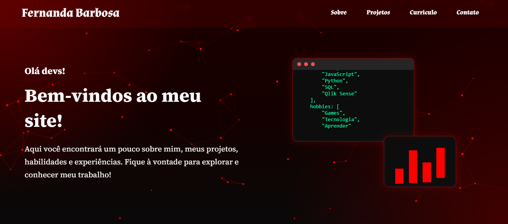

# 👩🏻‍💻 Portfólio | Fernanda Barbosa

Bem-vindo(a) ao meu portfólio!

Este projeto foi desenvolvido com o objetivo de apresentar minha trajetória, habilidades, projetos e evolução na área de desenvolvimento de software. O site reúne informações sobre minha formação, tecnologias que estudo e alguns dos projetos que desenvolvi durante minha jornada de aprendizado.

## 🚀 Acesse o projeto

🔗 **Portfólio Online:**  
https://barbbosa.github.io/portfolio

## 🛠️ Tecnologias utilizadas

- HTML5
- CSS3
- JavaScript
- Google Fonts

## ✨ Funcionalidades

- Página inicial com apresentação pessoal.
- Seção "Sobre Mim".
- Exibição das principais hard skills.
- Portfólio de projetos.
- Links para GitHub e LinkedIn.
- Fundo animado com partículas.
- Animação de digitação simulando código.
- Layout responsivo para diferentes dispositivos.

## 📷 Prévia



## 📂 Estrutura do projeto

```text
portfolio/
│
├── index.html
├── DevLab (Em desenvolvimento)
├── style.css
├── script.js
├── logos.img/
└── README.md
```

## 🎯 Objetivo

Este portfólio será atualizado continuamente conforme adquiro novos conhecimentos e desenvolvo novos projetos. O objetivo é documentar minha evolução como desenvolvedora e disponibilizar um espaço para apresentar meu trabalho.

## 📫 Contato

- 💼 LinkedIn: https://www.linkedin.com/in/fernandabramos/
- 💻 GitHub: https://github.com/Barbbosa

---

⭐ Se gostou do projeto, fique à vontade para deixar uma estrela no repositório!
